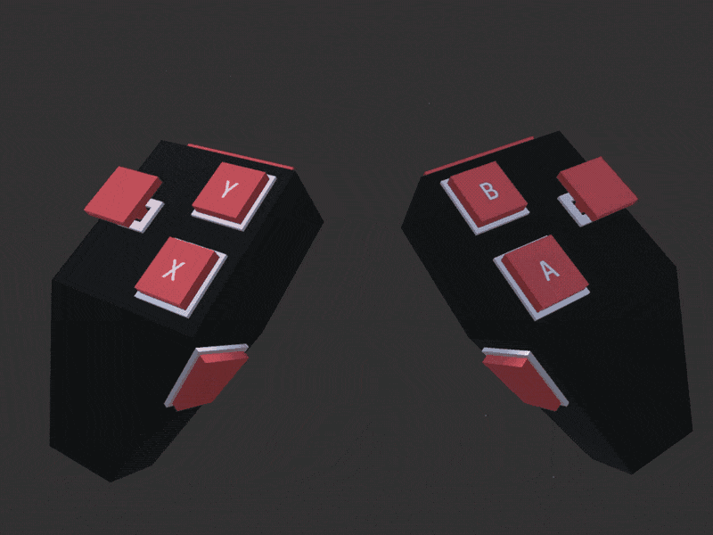

# VR Touch Controller

Minimalist Low Poly VR Touch Controllers for your awesome Unity project.

The demo works on the top of the New Input System, but you can use any type of systems to trigger the controller's methods.

# How to use it
* Import `VRController.unitypackage` into your project;
* Add the VR Controller prefabs to your XR rig and set up it (left / right);
* Subscribe VR COntroller methods to XR events.

# Notes
* Tested with 2021.v15.
* Added a Blender source file in a case you would like to change texture and UV.

